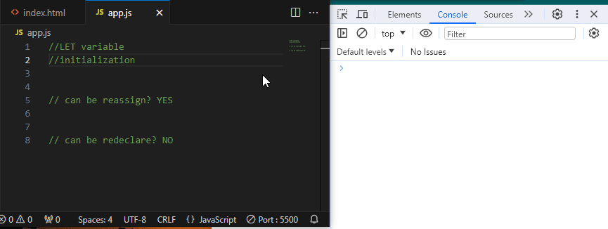
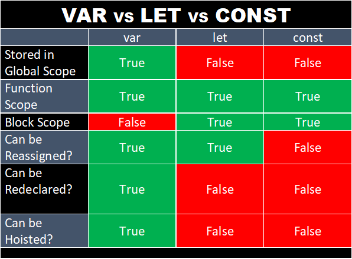

# ES6
JavaScript ES6 (ECMAScript 2015)

# What is ECMAScript 6
# ECMA Variables
## var, let and const
**var** , **let**, **const** are used for variable declaration in JavaScript, but they have some key differences in terms of scope, hoisting and mutability. **var** keyword have been used from the earlier versions of Javascript. **let** and **const** are introduced in ***ECMAScript 2015** that is generally know **ES6**. Here is a comprehensive comparsion between these three variable declaration keywords.
### 1. Scope:
+ **var**: Variable declared with **var** are function-scoped. They are accessible throughout the entire function in which they are declared, including inside nested blocks.
+ **let** and **const**: Variables declared with **let** and **const** are block-scoped. They are accessible only within the block in which they are defined, which included blocks like **`if`**, **`for`**, and **`while`** loops, as well as function blocks.

### 2. Hoisting:
+ `var`: Vaiable declared with **`var`** are hoisted to the top of their containing function or global scope. This means you can access a **`var`** variable before it is declared in the code, but its value will be *undefined* until the declaration is reached.
+ `let` and `const`: Variables declared with **`let`** and **`const`** are also hoisted, but they are not initialized. Trying to access them before their declaratoin results in a *ReferenceError*.

### 3. Reassignment:
### 4. Redeclaration:
### 5. Temporal Dead Zone(TDZ):
### 6. Global Object Property:
### 7. Use Cases:

Here are the brief description of each of variable types.
#### var

#### let

# Array Methods
## Array spread operator
## Destructuring of arrays
## Arrays' .include function

# ECMAScript Objects
## Object literals
## Objects spread operator
## Destructuring of Objects

# ECMAScript Functions
## Default function parameters
## Arrow functions
## 'this' in arrow function

# Asynchronous JavaScript
